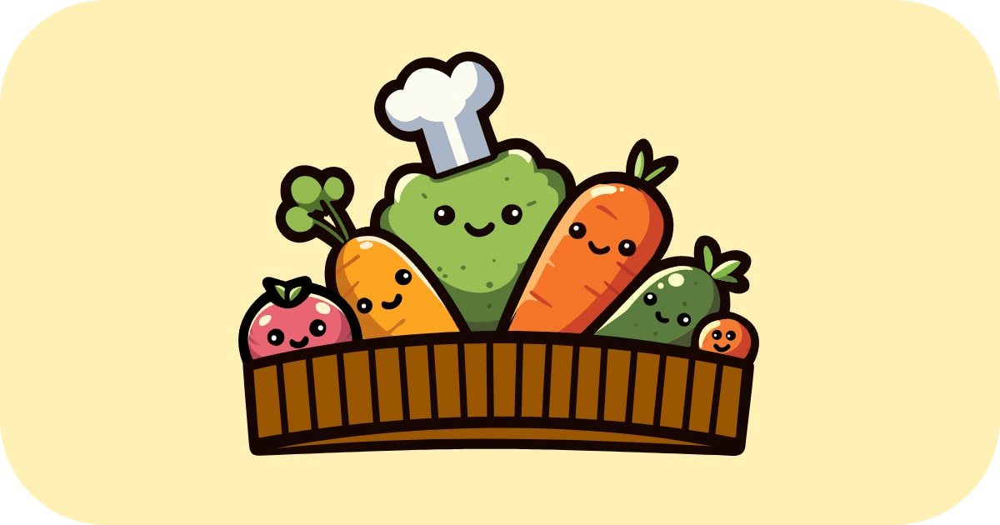
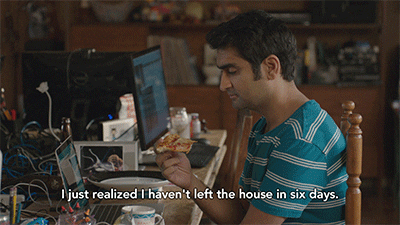

[](https://github.com/ClassyAJ/github-readme-stats)

<table>
  <tr>
    <td align="center">
      <a href="https://www.linkedin.com/in/aaron-joshua-beglau-100483276/">
        
      </a>
    </td>
    <td align="center">
      <a href="https://vegpur.de/">
        
      </a>
    </td>
  </tr>
</table>

### My mom said to introduce myself

```python
from typing import Self


class ClassyAJ:
    _instance = None

    def __new__(cls) -> Self:
        if cls._instance is None:
            cls._instance: Self = super().__new__(cls)
            cls._instance.name = "AJ"
            cls._instance.role = "Cloud Compute Engineer"
            cls._instance.employer = "STACKIT"
            cls._instance.the_not_so_important_languages = ["de", "en"]
            cls._instance.the_not_so_important_languages = ["python", "typescript"]
            cls._instance.specialities = ["FastAPI🧡", "cli ui/ux", "pandas", "design patterns", "backend"]
            cls._instance.about_me = {
                "what_i_enjoy": "playing catch with my son",
                "what_else": "professionally enjoying memes",
                "favourite_color": "orange, duh",
                "cant_live_without": "hot chocolate + coffee",
            }
        return cls._instance

    def moin(self) -> None:
        print(f"Hallo! I'm {self._instance.name}, your friendly {self._instance.role}.")


me = ClassyAJ()
me.moin()

batman = ClassyAJ()
print(me is batman)
> True
```



### yes. these rare pepes are mine
